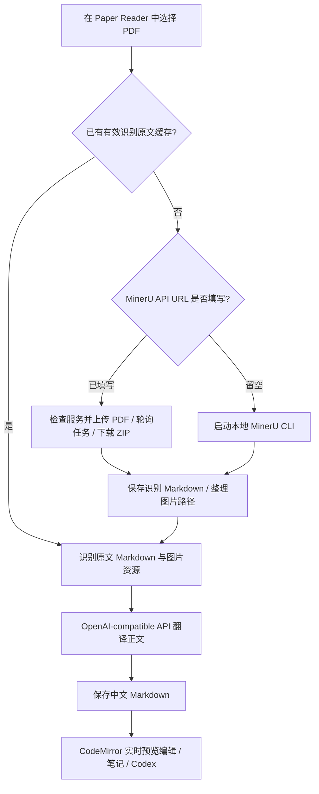

# Paper Reader

Paper Reader 是面向科研论文的 VS Code 阅读与编辑插件：阅读 PDF，通过 MinerU 将论文识别为带公式、表格和图片的 Markdown，再进行 AI 全文翻译、实时预览编辑、笔记整理和 Codex 选区问答。

**MinerU 文档识别是核心功能之一。** Paper Reader 作为它在 VS Code 中的前端，负责选择论文、提供解析选项、启动本地解析或上传远端任务、展示进度、接收 Markdown 与图片、保存结果并衔接翻译和编辑。模型推理由独立部署的 MinerU 完成，VSIX 不包含 Python 环境或 MinerU 模型。

当前稳定版：`1.5.5`（本地修复版）。历史 bug、根因、五阶段重构与测试记录集中在 [log.md](log.md)。

## 目录

- [安装与开始使用](#安装与开始使用)
- [MinerU 识别与论文工作流](#mineru-识别与论文工作流)
- [选择 MinerU 部署方式](#选择-mineru-部署方式)
- [方式 A：连接 MinerU API](#方式-a连接-mineru-api)
- [方式 B：启动本地 MinerU CLI](#方式-b启动本地-mineru-cli)
- [MinerU 配置项完整说明](#mineru-配置项完整说明)
- [模型下载、离线模型与 GPU](#模型下载离线模型与-gpu)
- [识别结果、图片与缓存](#识别结果图片与缓存)
- [AI 翻译配置](#ai-翻译配置)
- [自检与使用排查](#自检与使用排查)
- [PDF、Markdown、笔记与 Codex](#pdfmarkdown笔记与-codex)
- [开发与验证](#开发与验证)
- [实现依据与上游文档](#实现依据与上游文档)

## 安装与开始使用

1. 从 Release 下载 `paper-reader-1.5.5.vsix`，在 VS Code 扩展面板选择 **Install from VSIX...**，或执行：

   ```bash
   code --install-extension paper-reader-1.5.5.vsix --force
   ```

2. 更新安装后执行 `Developer: Reload Window`。
3. 点击活动栏的 Paper Reader 图标打开配置视图，或运行 `Paper Reader: Open Configuration`。按下文选择本地或远端 MinerU；要生成中文译文，还需要填写 AI API 配置。
4. 执行 `Paper Reader: Self Check` 检查连接。自检同时检查其他功能，单看 MinerU 项可判断 CLI/API 是否可访问；自检通过不等于已跑过模型推理。
5. 在资源管理器右键 PDF，选择 `Paper Reader: Translate Current PDF`；也可以先用 Paper Reader 打开 PDF，再从命令面板运行该命令。进度通知会显示解析、远端排队/处理、下载和翻译等阶段。
6. 完成后自动打开译文；识别原文和图片保存在输出目录，可单独用 `Paper Reader: Open Markdown` 打开。

**配置保存位置：** 配置面板先保存到扩展全局存储目录（`context.globalStoragePath`）下的 `paper-reader-settings.json`，再尝试同步到 VS Code 用户及当前工作区设置。读取 MinerU 配置时，内部保存值优先于 VS Code 设置。如果此前用面板保存过配置，之后只修改 `settings.json` 可能不会覆盖它；请回到面板修改对应项并保存。下文 JSON 示例适合初次配置，也可作为面板字段的填写参考。

## MinerU 识别与论文工作流

MinerU 负责文档理解：版面和阅读顺序分析、文字提取与 OCR、公式识别、表格结构还原以及图片资源提取；VLM/hybrid 后端还可进行图片/图表分析。Paper Reader 接收解析输出，将它变成可持续阅读和编辑的论文资料。



当前产品入口是 **PDF 全文翻译**，识别为其中的独立阶段：解析成功后先写入 `<论文名>.mineru-original.md` 和图片，再请求 AI 翻译。因此即使翻译 API 失败，已经写出的识别原文仍可阅读和复用。当前没有单独的“只识别并打开结果”命令；只需要识别时，可以使用下面的 MinerU CLI 示例生成 Markdown，再用 Paper Reader 打开。

MinerU 上游还支持图片和 Office 文档，但插件此入口目前只接受 `.pdf`，没有暴露批量目录识别、页码范围选择或全部 JSON 结构化输出。不要把上游能力直接理解为插件已有的 UI 功能。

## 选择 MinerU 部署方式

| 对比项 | MinerU API 模式 | 本地 CLI 模式 |
| --- | --- | --- |
| 适合情况 | 轻量阅读电脑连接 GPU 主机；或复用本机常驻服务 | 在运行扩展的机器上直接处理论文 |
| 如何选择 | `paper-reader.mineru.apiUrl` 填服务根地址 | `paper-reader.mineru.apiUrl` 留空 |
| 阅读端依赖 | VS Code、插件、网络连接 | 可执行的 MinerU CLI、Python 环境及相应后端依赖 |
| 模型和显卡在哪里 | API 服务所在机器 | CLI 所在机器 |
| 文档如何到达 MinerU | 插件直接通过 HTTP(S) 上传 PDF | 插件将 PDF 文件路径传给 CLI |
| 结果如何返回 | 下载包含 Markdown 和图片的 ZIP | 从本地临时输出目录读取 |
| 模型源、代理、显卡、内存参数 | 在 API 服务进程中配置 | 由插件设置转换成子进程环境变量 |

“本机”以扩展宿主实际运行的位置为准；使用 VS Code Remote SSH/WSL 时，文件路径、`mineru` 可执行文件及 `127.0.0.1` 均应按该宿主的位置理解。只有设置 `apiUrl` 才会走插件的直接 HTTP 客户端；它不会通过 SSH 自动启动远端服务。

## 方式 A：连接 MinerU API

### 1. 在解析主机安装 MinerU

下面基于本地核对的 **MinerU 3.4.0** 文档与代码，使用 Python 3.11 独立环境；也可使用已有 Conda 环境。需要由服务主机安装依赖，阅读电脑无需安装。

Linux / CachyOS（先安装 Python 3.11）：

```bash
python3.11 -m venv ~/.venvs/mineru
source ~/.venvs/mineru/bin/activate
python -m pip install --upgrade pip
python -m pip install "mineru[core]==3.4.0"
mineru --version
mineru-api --help
```

Windows PowerShell：

```powershell
py -3.11 -m venv "$env:USERPROFILE\venvs\mineru"
$mineruPython = "$env:USERPROFILE\venvs\mineru\Scripts\python.exe"
& $mineruPython -m pip install --upgrade pip
& $mineruPython -m pip install 'mineru[core]==3.4.0'
& "$env:USERPROFILE\venvs\mineru\Scripts\mineru.exe" --version
```

`core` 包含 pipeline 和基础 VLM 依赖，不包含 vLLM/LMDeploy 加速引擎。只运行 pipeline 可安装 `mineru[pipeline]`；需要加速 VLM/hybrid 时，Linux 可按上游要求安装 `mineru[core,vllm]`，Windows 可参考 `mineru[core,lmdeploy]`。`mineru[all]` 会带入更多平台相关依赖。显卡驱动、PyTorch 和推理引擎版本需匹配，具体要求见后文和上游平台指南。

### 2. 启动常驻解析服务

Linux 示例（已激活上述环境）：

```bash
export MINERU_MODEL_SOURCE=modelscope
export CUDA_VISIBLE_DEVICES=0
export MINERU_API_MAX_CONCURRENT_REQUESTS=1
export MINERU_PDF_RENDER_THREADS=1
export MINERU_PROCESSING_WINDOW_SIZE=2
export MINERU_API_OUTPUT_ROOT="$HOME/mineru-output"
mineru-api --host 0.0.0.0 --port 8000 --enable-vlm-preload false
```

Windows PowerShell 示例：

```powershell
$env:MINERU_MODEL_SOURCE = 'modelscope'
$env:CUDA_VISIBLE_DEVICES = '0'
$env:MINERU_API_MAX_CONCURRENT_REQUESTS = '1'
$env:MINERU_PDF_RENDER_THREADS = '1'
$env:MINERU_PROCESSING_WINDOW_SIZE = '2'
$env:MINERU_API_OUTPUT_ROOT = "$env:LOCALAPPDATA\PaperReader\MinerUApi\tasks"
& "$env:USERPROFILE\venvs\mineru\Scripts\mineru-api.exe" --host 0.0.0.0 --port 8000 --enable-vlm-preload false
```

首次请求可能下载/初始化模型；若已下载并配置离线模型，把 `MINERU_MODEL_SOURCE` 改为 `local`。只服务本机时用 `--host 127.0.0.1`；跨机器时可绑定实际局域网/Tailscale 地址。`0.0.0.0` 表示监听所有网卡，插件里仍应填写可达的实际地址。当前插件没有 API Token/自定义请求头配置，适合接入受控网络或隧道内的自建服务。

在阅读电脑检查服务：

```bash
curl http://192.168.1.100:8000/health
```

PowerShell 中可用 `Invoke-RestMethod 'http://192.168.1.100:8000/health'`。插件要求响应包含 `status: "healthy"` 和数值 `protocol_version: 2`；`version`、`queued_tasks`、`processing_tasks` 用于自检展示。协议版本 **2** 与 MinerU 软件版本 **3.4.0** 是不同概念。默认可访问 `/docs` 查看接口；关闭 `MINERU_API_ENABLE_FASTAPI_DOCS` 后该页面不再提供，但 `/health` 仍可检查。

### 3. 配置 Paper Reader

在配置面板填写 **MinerU API URL**，或初次配置时在 `settings.json` 中加入：

```json
{
  "paper-reader.mineru.apiUrl": "http://192.168.1.100:8000",
  "paper-reader.mineru.backend": "hybrid-engine",
  "paper-reader.mineru.effort": "high",
  "paper-reader.mineru.method": "auto",
  "paper-reader.mineru.formula": true,
  "paper-reader.mineru.table": true,
  "paper-reader.mineru.imageAnalysis": true,
  "paper-reader.mineru.fallbackToPdfJs": false
}
```

将地址替换为实际服务器。填服务根地址即可，不要加 `/tasks`、`/file_parse` 或 `/docs`。这不是 `mineru.net` 商业云 API 接口，也不是 Gradio WebUI 地址。API 模式忽略本地 `executable`、下载代理、模型源和设备设置；这些必须改在服务端进程上。

### 4. 插件如何调用 API

1. `GET /health`：校验健康状态及协议版本 2。
2. `POST /tasks`：流式上传 PDF，发送 backend、effort、解析方式、语言、公式/表格/图片分析开关，并请求 Markdown、图片和 ZIP 返回格式。
3. 服务返回 HTTP 202、`task_id`、`status_url`、`result_url`。插件约每秒轮询状态，显示 `pending` 排队人数或 `processing` 状态；`failed` 时展示服务错误。
4. `completed` 后下载结果 ZIP 到临时文件，逐项解压并检查路径；选取与 PDF 同名的 Markdown，找不到同名时选择最大的 Markdown 文件。
5. 整理原文与图片到插件输出目录，清理本地临时目录，继续翻译。

直接客户端要求异步 `/tasks` 协议，没有降级调用旧 `/file_parse` 的路径。它不发送 VLM `server_url`，也不请求原始 PDF、middle JSON 或 content list；远端模式按整份 PDF 提交。

健康请求超时为 15 秒，上传和单次状态请求为 2 分钟，结果请求为 10 分钟；这些由 Node 请求超时控制，并非整个传输的绝对总时长。轮询任务截止时间为 1 小时，这些值目前没有设置项。取消会停止客户端请求/轮询，**不会向服务端发送任务取消命令**，已经提交的解析任务可能继续运行。

### 5. 服务维护与现有启动脚本

服务器的 GPU、模型源、代理、线程和处理窗口都在启动服务前设置，改变后需重启相应服务。初次部署可从单任务、1 个渲染 worker、窗口 2 开始，确认峰值内存后再增加；这是保守起点，不是吞吐量最优值。

| 服务端环境变量 | 用途 |
| --- | --- |
| `CUDA_VISIBLE_DEVICES` | 选择服务可见 GPU |
| `MINERU_MODEL_SOURCE` | `huggingface` / `modelscope` / `local`；自动选择时不设置 |
| `MINERU_PDF_RENDER_THREADS` | PDF 渲染 worker 并发数 |
| `MINERU_PROCESSING_WINDOW_SIZE` | 单次处理窗口，影响内存和吞吐 |
| `MINERU_API_MAX_CONCURRENT_REQUESTS` | 同时处理任务数量 |
| `MINERU_API_OUTPUT_ROOT` | 服务端任务输出目录，与插件下载后的目录独立 |
| `MINERU_API_TASK_RETENTION_SECONDS` | 任务结束后的保留时间，上游默认 86400 秒 |
| `MINERU_API_TASK_CLEANUP_INTERVAL_SECONDS` | 过期任务清理间隔，上游默认 300 秒 |
| `MINERU_API_ENABLE_FASTAPI_DOCS` | 是否提供 `/docs` 等接口文档 |

上游任务状态在服务进程内维护；重启或开发热重载后不保证可查询旧任务。不建议为同一任务入口随意增加独立 worker 进程；多 GPU/多服务部署可参考上游 `mineru-router`，并确认入口仍满足协议 2 及同源任务 URL 要求。

仓库提供 [scripts/startMinerUApi.ps1](scripts/startMinerUApi.ps1) 作为已有 Windows/Tailscale 部署参考：等待指定网卡、检查端口、配置本地模型与保守并发、保留任务 1 小时，将日志追加到 `%LOCALAPPDATA%\PaperReader\MinerUApi\logs\mineru-api.log`。其中监听 IP、端口和 Conda 可执行文件路径是原部署机器的固定值，使用前必须修改；它不会安装 MinerU、下载模型或注册系统自启动。该脚本属于源码仓库，未随 VSIX 分发。

## 方式 B：启动本地 MinerU CLI

按上面的安装步骤在扩展宿主机器准备 MinerU，先用小 PDF 验证命令行：

```bash
mineru -p paper.pdf -o mineru-output -b pipeline --effort high -m auto -f true -t true --image-analysis true
```

也可以使用 `-b hybrid-engine`，但需要相应模型、依赖和硬件。只想提取 Markdown 时，运行此命令后直接在 Paper Reader 中打开输出 `.md`，无需配置翻译 API。

插件配置示例（Windows；将路径中的用户名替换为实际值）：

```json
{
  "paper-reader.mineru.apiUrl": "",
  "paper-reader.mineru.executable": "C:\\Users\\YOUR_NAME\\venvs\\mineru\\Scripts\\mineru.exe",
  "paper-reader.mineru.backend": "pipeline",
  "paper-reader.mineru.method": "auto",
  "paper-reader.mineru.modelSource": "modelscope",
  "paper-reader.mineru.proxyUrl": "",
  "paper-reader.mineru.device": "auto",
  "paper-reader.mineru.renderThreads": 1,
  "paper-reader.mineru.processingWindowSize": 2
}
```

Linux 可把 `executable` 改为 `/home/YOUR_NAME/.venvs/mineru/bin/mineru`；已在 VS Code 继承的 PATH 中时可以填 `mineru`。此项只能填可执行文件名/路径，不能填 `conda activate ... && mineru` 或连同参数的整段命令。插件使用 `spawn(executable, args)`，不会启动 shell 为你激活环境。若终端能运行但插件找不到，优先填写绝对路径。

实际调用参数为：

```text
<executable> -p <PDF路径> -o <临时输出目录> -b <backend>
  --effort <effort> -m <method> -f <formula> -t <table>
  --image-analysis <imageAnalysis> [-l <lang>]
```

3.4.0 MinerU CLI 自身会启动临时本地 API，Paper Reader 不需要额外开启常驻服务。插件从 stdout/stderr 提取版面、公式、OCR、表格等阶段提示；取消时 Windows 终止子进程树，其他平台向直接子进程发送 SIGTERM。CLI 退出后还会检查是否实际产出了 Markdown。

## MinerU 配置项完整说明

以下各项均以 **`paper-reader.mineru.`** 为前缀。默认值以插件 `package.json` 注册值为准；它们不一定与 MinerU CLI 默认值相同。

| 完整设置键 | 默认值 / 选项 | 作用与适用范围 |
| --- | --- | --- |
| `paper-reader.mineru.apiUrl` | `""` | 非空走直接 API 模式；空值走 CLI |
| `paper-reader.mineru.executable` | `"mineru"` | 仅 CLI：MinerU 可执行文件路径 |
| `paper-reader.mineru.backend` | `hybrid-engine`；`pipeline`、`vlm-engine`、`vlm-http-client`、`hybrid-http-client` | 两种模式均传递，详见下面的后端选择 |
| `paper-reader.mineru.effort` | `high` / `medium` | hybrid 解析强度；`high` 支持图片/图表分析，`medium` 会关闭该分析；上游 3.4.0 CLI 默认是 `medium` |
| `paper-reader.mineru.method` | `auto` / `txt` / `ocr` | pipeline/hybrid 的解析方式；`auto` 自动判定、`txt` 使用文本提取路径、`ocr` 强制 OCR |
| `paper-reader.mineru.lang` | `""` | OCR 语言提示，主要作用于 pipeline；可选 `ch`、`ch_server`、`korean`、`ta`、`te`、`ka`、`th`、`el`、`arabic`、`east_slavic`、`cyrillic`、`devanagari` |
| `paper-reader.mineru.formula` | `true` | 请求启用公式识别 |
| `paper-reader.mineru.table` | `true` | 请求启用表格识别 |
| `paper-reader.mineru.imageAnalysis` | `true` | VLM/hybrid 图片和图表分析；它不等同于下载/保存图片，远端返回图片资源仍单独启用 |
| `paper-reader.mineru.modelSource` | `auto`；`huggingface`、`modelscope`、`local` | 仅 CLI：转换成 `MINERU_MODEL_SOURCE`；`auto` 从子进程环境移除此变量，交由 MinerU 决定 |
| `paper-reader.mineru.proxyUrl` | `""` | 仅 CLI：本地模型后端且来源不是 `local` 时，将非空值写入子进程 HTTP/HTTPS/ALL_PROXY；不会代理插件的直接 API 请求 |
| `paper-reader.mineru.device` | `auto` / `cpu` / `cuda` | 仅 CLI：`auto` 保留环境；`cpu` 将 `CUDA_VISIBLE_DEVICES=-1`，`cuda` 使用下一项；实际后端仍需支持所选硬件 |
| `paper-reader.mineru.cudaDevice` | `"0"` | 仅 CLI 且 `device=cuda` 时写入 `CUDA_VISIBLE_DEVICES` |
| `paper-reader.mineru.renderThreads` | `1`，最小 1 | 仅 CLI：`MINERU_PDF_RENDER_THREADS`，降低可减少峰值内存 |
| `paper-reader.mineru.processingWindowSize` | `2`，最小 1 | 仅 CLI：`MINERU_PROCESSING_WINDOW_SIZE`，在内存和吞吐间取舍 |
| `paper-reader.mineru.fallbackToPdfJs` | `false` | MinerU 失败后是否降级到 PDF.js 文本提取；两种模式都适用，不提供 MinerU 等价的 OCR、公式/表格结构识别 |

`lang` 留空时，本地 CLI 不传 `-l`；直接 API 模式会提交 `lang_list=ch`。`ch` 也是上游常见默认 OCR 选项，包含中英文场景，不要自行填写未注册的 `en`。识别开关的实际效果受后端和服务器环境变量影响。

### 后端选择与两个不同的“远程地址”

| 后端 | 适用方式 |
| --- | --- |
| `pipeline` | 传统版面/OCR/公式/表格流水线，CPU 可运行，也可 GPU 加速；先验证环境时较容易定位依赖问题 |
| `hybrid-engine` | 插件默认，结合 pipeline 与 VLM；用于具备相应算力和模型的解析机器 |
| `vlm-engine` | 使用 VLM 解析，需相应模型和推理环境 |
| `vlm-http-client` / `hybrid-http-client` | MinerU 自身连接远端 VLM 推理服务的后端；与插件直接连接 MinerU API 是不同层次 |

**常用的跨机器方案是 `apiUrl + hybrid-engine`（或 `pipeline`），阅读端不需要选择 `*-http-client`。** 上游 `mineru-api`（常见端口 8000）接收完整文档任务；`mineru-openai-server`（上游示例端口 30000）服务于 MinerU 内部 VLM 推理；Gradio（常见端口 7860）是另一套用户界面。

虽然插件下拉框列出了 `*-http-client`，当前插件没有独立的 `-u/--url`、`server_url` 设置：本地 CLI 参数与直接 API 表单均未传递它。因此不能仅通过更改下拉框完成这种部署，也不能把推理端口填到 `apiUrl`。需要此高级模式时请自行调用上游 CLI，并用 Paper Reader 打开结果；标准插件接入优先使用 `mineru-api` + engine/pipeline。

## 模型下载、离线模型与 GPU

### 模型源和代理

- `huggingface`、`modelscope` 是模型下载来源；首次运行会产生模型下载及初始化开销。
- `auto` 交给 MinerU 决策。3.4.0 文档说明会探测来源并可能把结果写回 `mineru.json`，不意味着每次都重新选择。
- `local` 表示使用已配置的本地模型目录，不是“自动下载后缓存”的同义词。

本地 CLI 可在插件设置模型源；API 模式在服务器进程设置。`proxyUrl` 非空时会作用于符合条件的整个 MinerU 子进程环境；留空只表示插件不注入代理，**不会删除 VS Code 已继承的代理变量**。插件会在未提供时为 `NO_PROXY/no_proxy` 设置 `127.0.0.1,localhost`，已有值则沿用。

### 预下载和离线运行

在真正执行模型推理的机器和环境中运行：

```bash
mineru-models-download
```

按交互提示选择来源与所需模型。下载工具会将模型目录写入用户目录下的 `mineru.json`。pipeline 需要对应 pipeline 模型，VLM 需要 VLM 模型，hybrid 通常需要二者；实际以所装 MinerU 版本为准。移动模型后同步修改目录，例如：

```json
{
  "model-source": "modelscope",
  "models-dir": {
    "pipeline": "/srv/mineru-models/pipeline",
    "vlm": "/srv/mineru-models/vlm"
  }
}
```

上例为 `mineru.json` 的相关字段示意，请保留现有文件其他配置，将路径替换为下载工具输出的实际模型根目录。然后本地插件设置 `paper-reader.mineru.modelSource=local`；远端服务则设置 `MINERU_MODEL_SOURCE=local` 后启动。Windows 默认配置文件为 `%USERPROFILE%\mineru.json`，Linux 为 `~/mineru.json`；`MINERU_TOOLS_CONFIG_JSON` 可指定其他配置路径，必须在对应进程环境中设置。

MinerU 配置文件还支持 LaTeX 分隔符和 LLM 辅助标题分级等上游能力。为配合论文 Markdown 编辑流程，建议保留默认行内 `$...$` 和独立 `$$...$$` 分隔符。MinerU 的标题辅助 LLM 配置与 Paper Reader 的正文翻译 API 相互独立，插件不会替你同步二者的密钥、地址或模型。

### 硬件选择

核对的 MinerU 3.4.0 上游给出的参考要求：pipeline 支持纯 CPU，GPU 模式约需至少 4 GB 显存；VLM/hybrid engine 不面向纯 CPU，参考显存至少 8 GB；本地推理内存至少 16 GB、建议 32 GB，磁盘至少 20 GB。文档页数、图像分辨率、后端和并发会影响实际峰值，最低值不是所有论文都能处理的保证。使用远端 API 时这些要求属于服务器。

在安装 MinerU 的同一 Python 环境中检查 CUDA：

```bash
python -c "import torch; print(torch.__version__); print(torch.cuda.is_available()); print(torch.cuda.device_count())"
```

`device=cuda` 只是控制可见 GPU，不能把 CPU 版 PyTorch 变为 CUDA 版；需按 [PyTorch 安装说明](https://pytorch.org/get-started/locally/) 和 MinerU 平台指南安装匹配依赖。`device=cpu` 实际只是隐藏 CUDA，不是跨平台的完整设备强制选项；CPU 解析优先配合 `pipeline`。

## 识别结果、图片与缓存

默认保存位置：

```text
paper-reader-output/
└─ translations/
   └─ <PDF 文件名，不含扩展名>/
      ├─ <论文名>.mineru-original.md
      ├─ <论文名>.deepseek-zh.md
      └─ assets/
         └─ images/
```

`paper-reader.output.directory` 默认 `paper-reader-output`，可以改为绝对路径。相对路径以第一个工作区目录为基准；未打开工作区时以 PDF 所在目录为基准。目录名会清理不合法字符。目前译文仍使用 `.deepseek-zh.md` 文件名，即使实际配置了其他 OpenAI-compatible 服务。

插件复制识别 Markdown 同级的 `images` 目录到 `assets/images`，并将 Markdown 图片路径 `images/...` 改写为 `assets/images/...`。原文和译文共用这些图片；移动结果时应连同整篇论文目录一起移动。插件保留的是整理后的 Markdown 和图片，不会把 MinerU 的全部中间 JSON、可视化调试 PDF 或 ZIP 永久保存到此目录。

**缓存复用规则：** `.mineru-original.md` 存在、非空，且修改时间不早于 PDF 时，下一次全文翻译会直接复用它，跳过 MinerU。缓存原文也可手动校正后再次翻译。

- 改 backend、OCR、公式开关或模型源不会自动清掉缓存；需先备份并移走/重命名对应 `.mineru-original.md`，再执行全文翻译，才能重新识别。
- 当前依据文件名和修改时间检查，不做 PDF 内容哈希或参数指纹校验；不同目录的同名 PDF 共用输出根时可能落入同一目录，可为它们选择不同输出根。
- 翻译失败后重试通常可以复用已保存的识别结果，不必再次等待模型识别。
- 启用 PDF.js 降级后生成的原文也沿用此文件名和缓存规则；文件头的 `Extracted by ...` 才能区分真实来源。需要恢复 MinerU 高质量识别时应主动重新生成原文。

## AI 翻译配置

MinerU 负责“看懂文档结构并提取内容”，AI API 负责“翻译正文”。它们有不同的地址、模型和资源消耗。要完成插件的一键 PDF 到中文 Markdown 流程，可在配置面板填写：

| 设置 | 默认值 / 用途 |
| --- | --- |
| `paper-reader.ai.baseUrl` | `https://api.deepseek.com`，可替换为 OpenAI-compatible 地址 |
| `paper-reader.ai.model` | `deepseek-v4-flash`，应改为供应商实际可用模型 |
| `paper-reader.ai.apiKey` | 默认为空，填翻译服务密钥 |
| `paper-reader.ai.translationConcurrency` | 默认 `6`，范围 `1–20`，控制翻译批次并发，不是 MinerU 解析并发 |
| `paper-reader.ai.translationPrompt` | 正文翻译提示词，保留默认的 JSON 与占位符约定 |

API 密钥也可通过启动 VS Code 时的环境变量提供，读取顺序是 `PAPER_READER_AI_API_KEY`、`DEEPSEEK_API_KEY`、配置值。API 模式下 PDF 会上传给 MinerU 服务器；翻译阶段将处理后的正文段落发送给所配置的翻译服务。

翻译前插件保护公式、代码块、图片引用、行内代码等内容，以占位符组织正文批次，收到结果后恢复这些内容。它不能纠正识别阶段已经丢失的公式或阅读顺序；遇到识别质量问题，应先查看 `.mineru-original.md`，调整 MinerU 并重新生成，再翻译。

## 自检与使用排查

`Paper Reader: Self Check` 在本地模式尝试执行 `mineru --version`，失败后尝试 `--help`；远端模式检查 `/health` 并显示版本、协议和队列状态。它不会下载所有模型或运行一次完整 PDF 推理，部署后仍建议先用短论文测试完整流程。

| 情况 | 处理方法 |
| --- | --- |
| 本地找不到 `mineru` / `ENOENT` | 填虚拟环境中的可执行文件绝对路径，确认扩展宿主位置与 PATH |
| 远端健康检查失败 | 从扩展宿主机器访问 `/health`；检查地址、端口、局域网/Tailscale 连通性与服务是否启动 |
| 提示协议不是 2，或 `/tasks` 不存在 | 当前客户端需要异步协议 2；检查安装版本与 endpoint，不能只凭旧 `/file_parse` 可用判断兼容 |
| 自检通过但第一次识别很久 | 查看 MinerU 服务/进程日志，区分模型下载、模型初始化、排队和推理；可提前下载模型 |
| 选择 CUDA 仍很慢或不可用 | 在 MinerU 环境检查 PyTorch CUDA 支持、驱动与 GPU 可见性；远端模式在服务器检查 |
| 内存/显存不足 | 本地降低窗口、渲染并发；远端降低服务任务并发及窗口；必要时选择 pipeline 或降低识别选项，重新识别前处理缓存 |
| 设置改了但输出没变 | 确认配置面板内部值，以及是否直接复用了原文缓存 |
| 识别完成但翻译报 API 错误 | 打开已保存的 `.mineru-original.md`；检查 AI 密钥/地址/模型后重试 |
| Markdown 看不到图片 | 确认同目录 `assets/images` 仍存在；原始 CLI 输出则应连同其 `images` 目录打开 |
| 想要 VLM HTTP 后端，但没有服务器地址输入框 | 当前插件没有 `server_url` 配置；参考后端章节，使用常规 API + engine 或独立 CLI |

自定义反向代理须让 `status_url`、`result_url` 保持与配置 API 地址同源，插件拒绝跨源任务结果 URL。API URL 中的用户名、密码和查询参数会被规范化移除，不能据此传递认证；也没有自动使用浏览器登录态的机制。

## PDF、Markdown、笔记与 Codex

- **PDF 阅读：** `Paper Reader: Open Current PDF`，或用 PDF 的 `Open With...` 选择 Paper Reader，提供 PDF.js 阅读、选区操作及笔记标记。
- **Markdown 实时编辑：** `Paper Reader: Open Markdown` 使用 CodeMirror 6 + Lezer 保存原文与编辑状态，按可见区域显示公式、表格、代码块和图片；KaTeX 渲染公式，点击相应内容可切换到源码编辑。也提供 `Paper Reader: Open Markdown Text Preview`。
- **笔记：** `Paper Reader: Add Note`、`Paper Reader: Open Notes`，可将阅读选区整理为 Markdown 笔记，并查看知识图谱。
- **Codex 联动：** PDF、Markdown 和普通代码选区可经命令发送到官方 `openai.chatgpt` 扩展。需单独安装该扩展；Paper Reader 使用公开命令及文档桥接，不依赖闭源内部 API。

## 开发与验证

在本仓库根目录执行：

```bash
npm install
npm run compile
npm run build:markdown
```

按 `F5` 启动 Extension Development Host，在新窗口中用 Paper Reader 打开文件。Webview 调试使用 `Developer: Open Webview Developer Tools`。打包命令：

```bash
npm run package
```

基础质量检查：

```bash
npm run compile
npm run lint
npm run test:unit
npm run test:performance
npm run test:markdown-performance
npm run test:markdown-selection
npm test
```

Windows 集成测试可用 `VSCODE_TEST_EXECUTABLE` 指定实际 `Code.exe` 路径。两个 performance 脚本包含静态守卫；需要浏览器长文档运行时检查时，设置 `HEADING_SELECTION_LONG=true` 后执行 `npm run test:markdown-selection`。真实论文 fixture、字符级扫描和历史验证限制见 [log.md](log.md)。这些编辑器测试不等同于真实 MinerU/GPU/翻译服务的端到端验证。

## 实现依据与上游文档

本文于 **2026-09-26** 按当前插件实现及本地 `MinerU` 源码核对。上游参考快照为 **3.4.0，提交 `3e602918`（2026-06-18）**；本地目录为 `E:\Desktop\repo\paper-reader\MinerU`，仅是本次参考位置，使用插件无需克隆到此路径。此版本说明不是对 GitHub 最新版本的声明；升级上游时先检查 CLI 参数与 API 协议兼容性。

| 实现文件 | 职责 |
| --- | --- |
| [src/paperTranslation.ts](src/paperTranslation.ts) | 配置读取、本地 CLI、API 分流、原文缓存、图片归档与翻译编排 |
| [src/minerURemoteClient.ts](src/minerURemoteClient.ts) | 健康检查、任务上传、轮询、ZIP 下载与解压 |
| [src/configurationPanel.ts](src/configurationPanel.ts)、[src/config.ts](src/config.ts) | 配置界面、内部存储和配置优先级 |
| [package.json](package.json) | 用户命令、设置项、默认值与枚举 |
| [src/diagnostics.ts](src/diagnostics.ts) | 本地 CLI 与 API 自检 |
| [src/deepSeekClient.ts](src/deepSeekClient.ts) | Markdown 内容保护与批次翻译 |
| [src/markdownWysiwygProvider.ts](src/markdownWysiwygProvider.ts)、[media/markdown/codemirror-entry.js](media/markdown/codemirror-entry.js) | Markdown 编辑器与实时预览 |

上游参考：

- [MinerU 官方仓库](https://github.com/opendatalab/MinerU)
- [本次核对的快照](https://github.com/opendatalab/MinerU/tree/3e602918)
- [快速使用与 API](https://opendatalab.github.io/MinerU/zh/usage/quick_usage/)
- [CLI 参数与环境变量](https://opendatalab.github.io/MinerU/zh/usage/cli_tools/)
- [模型源与本地模型](https://opendatalab.github.io/MinerU/zh/usage/model_source/)
- [扩展模块安装](https://opendatalab.github.io/MinerU/zh/quick_start/extension_modules/)
- [GPU 与推理引擎参数](https://opendatalab.github.io/MinerU/zh/usage/advanced_cli_parameters/)
- [MinerU FAQ](https://opendatalab.github.io/MinerU/zh/faq/)

## License

Paper Reader 许可证见 [LICENSE](LICENSE)，第三方声明见 [THIRD_PARTY_NOTICES.md](THIRD_PARTY_NOTICES.md)。MinerU、模型和推理依赖适用各自许可证，请以对应上游发布为准。
